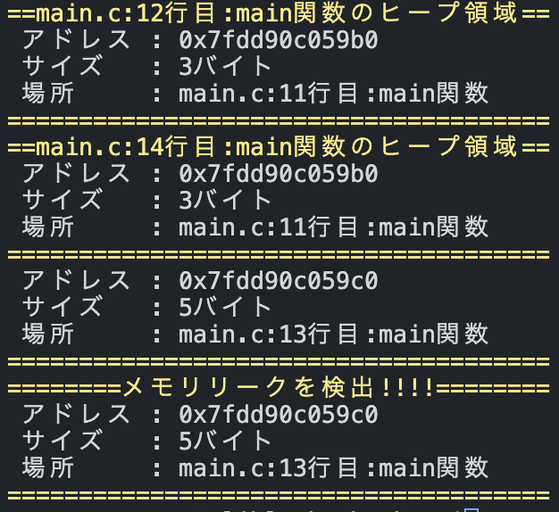

# libleak_checker

C言語のメモリリークを検出してくれるツールです。



# 機能

- メモリリークの検出
- プログラム実行中のメモリ未開放領域の検出
- mallocで確保した領域の情報を記憶＆表示

# 使い方

1. リポジトリをgit clone

	作業ディレクトリ内にリポジトリをcloneします。
	```
	git clone https://github.com/kiri-42/libleak_checker.git
	```
1. makeの実行

	cloneしたディレクトリに移動し、makeコマンドを実行します。
	```
	cd libleak_checker
	make
	```
1. ヘッダーファイルをインクルード

	検査したいプログラムにleak_checker.hとreplace_leak.hをインクルードします。
	```
	#include "libleak_checker/leak_checker.h"
	#include "libleak_checker/replace_leak.h"
	```
1. leak_checker_init()を呼び出し

	main関数の最初の行にleak_checker_init();を追記します。
	特定の行でメモリ未開放領域を確認したいときは、その行にleak_checker_check();を追記します。
1. コンパイルして実行

	2.で作成したlibleak_checker.aを含めてコンパイルして実行すればメモリリークの情報を標準出力に検出してくれます。

# 注意事項

プログラムをexitで終了してください。
main関数のreturn終了やCtrl + Dには対応していません。
